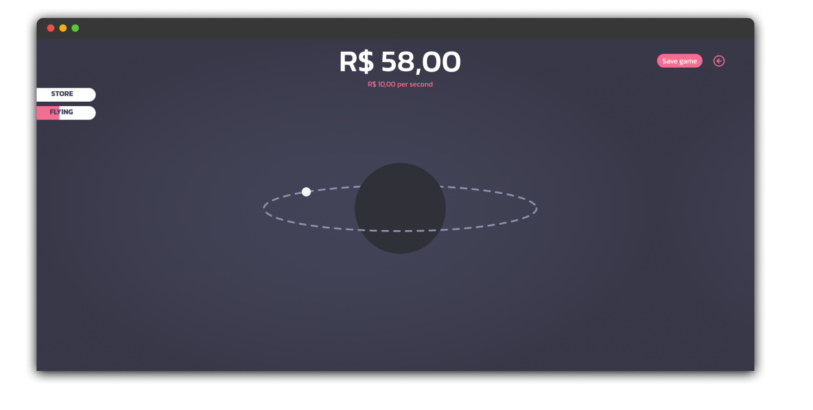
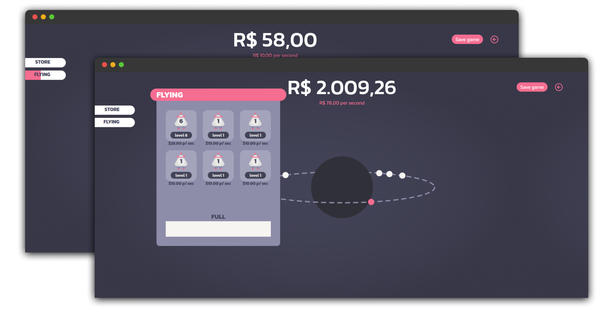

  

# Idle Game

## Description

This is a web browser game with an idle concept. It envolves ships in a 2x3 grid where you merge two of the same type together to get a third better one. 

[Click here to play on browser](https://idlegame.vercel.app/)

>At the moment there's a phisical limit of 6 ships for obvious reasons, but on the future will be implemented a system to overcome that

## Game pictures

  

## Disclaimers 

- The game only refresh the current money when you're on the browser tab.
- Store with items comming in the future
- Login is based on names, so be quickly to be the first to get yours
- No password changes implemented
- Provisory sqlite3 database for players and ships
- Ships speeds on the planet miniature are random
- Rank system to be added

> _database yet to be migrated to 24/7 service_