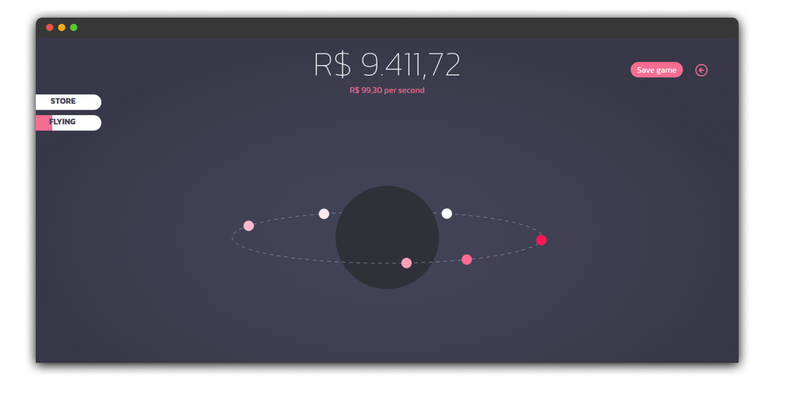
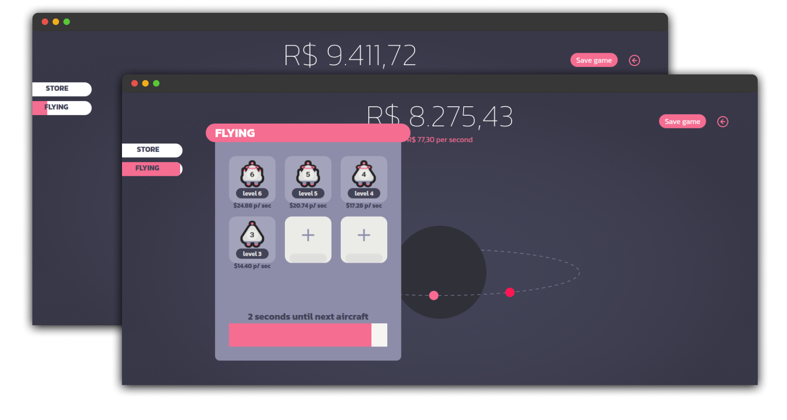

 
 

# Idle Game

## Description

This is a web browser game with an idle concept. It envolves aircrafts in a 2x3 grid where you merge two of the same type together to get a third better one. 

[Click here to play on browser](https://idlegame.vercel.app/)

>At the moment there's a limit of 6 aircrafts

## Game pictures

  

## Disclaimers 

- The game only refresh the current money when you're on the browser tab.
- Store with items comming in the future
- Login is based on names, so be quickly to be the first to get yours
- No password changes implemented
- Provisory sqlite3 database for players and aircrafts
- Rank system to be added

> _database yet to be migrated to 24/7 service_

## Older versions

[v1.0](./v1.0.md)
